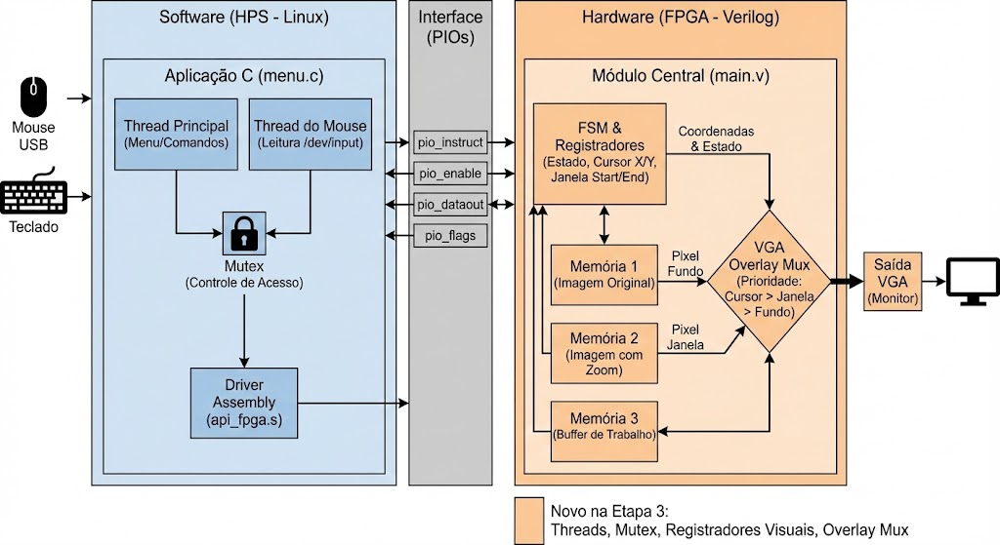

# Zoom Digital: Módulo de Redimensionamento de Imagens

## Sumário
* [1. Visão Geral do Projeto](#1-visão-geral-do-projeto)
* [2. Definição do Problema](#2-definição-do-problema)
* [3. Requisitos do Projeto](#3-requisitos-do-projeto)
    * [3.1. Requisitos Funcionais](#31-requisitos-funcionais)
    * [3.2. Requisitos Não Funcionais](#32-requisitos-não-funcionais)
* [4. Fundamentação Teórica](#4-fundamentação-teórica)
    * [4.1. Zoom In (Aproximação)](#41-zoom-in-aproximação)
    * [4.2. Zoom Out (Redução)](#42-zoom-out-redução)
* [5. Ambiente de Desenvolvimento](#5-ambiente-de-desenvolvimento)
    * [5.1. Software Utilizado](#51-software-utilizado)
    * [5.2. Hardware Utilizado](#52-hardware-utilizado)
* [6. Manual do Usuário](#6-manual-do-usuário)
    * [6.1. Instalação e Configuração](#61-instalação-e-configuração)
    * [6.2. Comandos de Operação](#62-comandos-de-operação)
* [7. Descrição da Solução](#7-descrição-da-solução)
    * [7.1. `soc_system.qsys` (Sistema HPS e Barramento)](#71-soc_systemqsys-sistema-hps-e-barramento)
    * [7.2. `ghrd_top.v` (Arquivo Top-Level)](#72-ghrd_topv-arquivo-top-level)
    * [7.3. `main.v` (Módulo do Coprocessador)](#73-mainv-módulo-do-coprocessador)
    * [7.4. `mem1.v` (Módulo de Memória)](#74-mem1v-módulo-de-memória)
    * [7.5. `api_fpga.s` (A API de Hardware em Assembly)](#75-api_fpgas-a-api-de-hardware-em-assembly)
    * [7.6. `constantes.h` (O Dicionário do Projeto)](#76-constantesh-o-dicionário-do-projeto)
    * [7.7. `menu.c`](#77-menuc-a-aplicação-principal)
* [8. Testes e Validação](#8-testes-e-validação)
    * [8.1. Teste de Zoom In](#81-teste-de-zoom-in)
    * [8.2. Teste de Zoom Out](#82-teste-de-zoom-out)
    * [8.3. Seleção de "Janela" de Zoom](#83-seleção-de-janela-de-zoom)
* [9. Análise dos Resultados](#9-análise-dos-resultados)

---

## 1. Visão Geral do Projeto

Este projeto foi desenvolvido como parte da avaliação da disciplina de Sistemas Digitais (TEC499) do curso de Engenharia de Computação da Universidade Estadual de Feira de Santana (UEFS). O objetivo principal é projetar um módulo embarcado para redimensionamento de imagens em tempo real, aplicando efeitos de zoom in e zoom out.

Nesta etapa, o sistema passa a ser controlado pelo processador HPS (ARM) , que executa uma aplicação em C. Esta aplicação, acessada pelo usuário via terminal SSH, aceita comandos do teclado e utiliza a API em Assembly para enviar os comandos de processamento ao coprocessador na FPGA.

A base do codigo em Verilog foi fornecida pelo seguinte repositório: <https://github.com/DestinyWolf/Problema-SD-2025-2> com devida permissão do Autor.

## 2. Definição do Problema

O tema deste problema é a **Programação Assembly e a construção de um driver de software** para a interface hardware-software.

O objetivo é projetar um **módulo embarcado de redimensionamento de imagens** (zoom in/out) para sistemas de vigilância e exibição em tempo real.

Este repositório consiste em construir uma biblioteca de funções (API) em Assembly. Esta API permite que o HPS (controlador) se comunique com o coprocessador gráfico (na FPGA) através de um repertório de instruções.


## 3. Requisitos do Projeto

A seguir estão os requisitos funcionais e não funcionais a serem desenvolvidos o durante este projeto.

### 3.1. Requisitos Funcionais

* **RF01:** O sistema deve implementar algoritmos de zoom in (aproximação) e zoom out (redução) em imagens.
* **RF02:** As operações de redimensionamento devem ser em passos de 2X.
* **RF03:** O algoritmo de **Vizinho Mais Próximo** (*Nearest Neighbor*) deve ser implementado para a aproximação.
* **RF04:** O algoritmo de **Replicação de Pixel** deve ser implementado para a aproximação.
* **RF05:** O algoritmo de **Decimação/Amostragem** deve ser implementado para a redução.
* **RF06:** O algoritmo de **Média de Blocos** deve ser implementado para a redução.
* **RF07:** A seleção da operação (zoom in/out) deve ser controlada pelo teclado do computador integrado a placa pelo HPS.
* **RF08:** A imagem processada deve ser exibida em um monitor através da saída VGA.

### 3.2. Requisitos Não Funcionais

* **RNF01:** O código da API deve ser escrito em linguagem Assembly;
* **RNF02:** O projeto deve utilizar apenas os componentes disponíveis na placa de desenvolvimento **DE1-SoC**.
* **RNF03:** As imagens devem ser representadas em escala de cinza, com cada pixel codificado por um inteiro de 8 bits.
* **RNF04:** O coprocessador deve ser compatível com o processador ARM (Hard Processor System - HPS) para viabilizar o desenvolvimento da solução.
* **RNF05:** A imagem deve ser lida a partir de um arquivo e transferida para o coprocessador;
* **RNF06:** Deverão ser implementados na API os comandos da ISA do coprocessador. As instruções devem utilizar as operações que foram anteriormente implementadas via chaves e botões na placa (vide Problema 1).

## 4. Fundamentação Teórica

Esta seção detalha a teoria por trás dos algoritmos de redimensionamento de imagem implementados.

### 4.1. Zoom In (Aproximação)

Aproximar uma imagem significa criar novos pixels onde antes não existia informação.

* **Vizinho Mais Próximo (Nearest Neighbor) [RF03]**
    * **Teoria:** Este é o algoritmo de interpolação mais simples. Para cada pixel na imagem de destino (maior), ele calcula qual seria a sua coordenada correspondente na imagem original.
    * **Funcionamento:** O algoritmo arredonda essa coordenada para o número inteiro "vizinho mais próximo" (ex: 2.5 torna-se 3) e simplesmente copia o valor do pixel dessa posição.
    * **Resultado:** É computacionalmente muito leve e rápido, mas produz um resultado "serrilhado" ou "pixelado", com bordas visivelmente quadradas.

* **Replicação de Pixel [RF04]**
    * **Teoria:** Este método é uma forma de *upscaling* que foca em duplicar a informação existente, em vez de interpolar.
    * **Funcionamento:** Para um zoom 2x, o algoritmo simplesmente "estica" a imagem, fazendo com que cada pixel original na posição `(x, y)` se torne um bloco de 2x2 pixels idênticos na imagem de destino, preenchendo as posições `(2x, 2y)`, `(2x+1, 2y)`, `(2x, 2y+1)` e `(2x+1, 2y+1)`.
    * **Resultado:** No contexto de um zoom 2x, o resultado visual é **idêntico** ao do Vizinho Mais Próximo. É igualmente rápido e resulta em bordas pixeladas.

### 4.2. Zoom Out (Redução)

Reduzir uma imagem significa descartar informações (pixels) de forma inteligente.

* **Decimação / Amostragem [RF05]**
    * **Teoria:** método rápido e computacionalmente simples de redução.
    * **Funcionamento:** O algoritmo "pula" pixels. Para uma redução 2x, ele lê o valor de 1 em cada 2 pixels, tanto na horizontal quanto na vertical, descartando os uma parte de pixels restantes.
    * **Resultado:** Rápido, mas a qualidade da imagem resultante é baixa. A grande perda de dados pode causar de bordas serrilhadas e perda de detalhes finos.

* **Média de Blocos [RF06]**
    * **Teoria:** Este método produz um resultado de qualidade superior ao da decimação, pois considera todos os pixels da imagem original.
    * **Funcionamento:** Para cada pixel na imagem de destino (reduzida), o algoritmo calcula a média de um "bloco" de pixels correspondente na imagem original. Para uma redução 2x, ele lê um bloco de 2x2 pixels, soma seus valores de intensidade e divide por 4 (média).
    * **Resultado:** A imagem resultante é mais suave, com menos serrilhado e representa melhor a imagem original, pois nenhuma informação é completamente descartada.

## 5. Ambiente de Desenvolvimento

### 5.1. Software Utilizado

| Software | Versão | Descrição |
| :--- | :--- | :--- |
| Quartus Prime | 23.1.0 | Ferramenta de desenvolvimento para FPGAs Intel. |
| GNU/Linux Shell (bash) | (N/A)| Interface de linha de comandos (terminal) acedida via SSH. |

### 5.2. Hardware Utilizado

| Componente | Especificação |
| :--- | :--- |
| Kit de Desenvolvimento | Terasic DE1-SoC |
| Monitor | Monitor com entrada VGA. |
| Computador | Para compilação do projeto e controle do Zoom In e Zoom Out |

## 6. Manual do Usuário

Esta seção descreve como instalar, configurar e operar o sistema, servindo como o manual do usuário do projeto.

### 6.1. Instalação e Configuração

1.  **Clonar o Repositório:**
    ```bash
    git clone [https://github.com/VitorAugusto210/SD-Problema2.git](https://github.com/VitorAugusto210/SD-Problema2.git)
    cd <NOME_DO_SEU_REPOSITORIO>
    ```
2.  **Configuração do Quartus Prime:**
    * Abra o Quartus Prime.
    * Abra o arquivo de projeto `.qpf` (localizado na pasta `Coprocessador`).
3.  **Compilação (Hardware):**
    * Com o Quartus aberto, clique no botão de Start Compilation.
        
    * Isso irá gerar o arquivo de programação (`.sof`).
4.  **Programação da FPGA:**
    * Conecte a placa DE1-SoC ao computador.
    * Abra o "Programmer" no Quartus Prime.
        
    * Selecione o arquivo `.sof` gerado e programe a placa.
    * Clique em "Start" e as instruções serão repassadas a placa.

5.  **Conectando e Compilando o Software no HPS:**
    * Abra um terminal e conecte-se à placa via SSH:
        ```bash
        ssh aluno@172.65.213.<Digitos finais da Placa utilizada>
        # Forneça a senha da máquina assim que solicitada
        ```
    * Transfira os arquivos de software (`menu.c`, `constantes.h`, `api_fpga.s`, `Makefile`) do seu computador para a placa usando `scp`.
    * Transfira a imagem bitmap e o Make file para a placa:
        ```bash
        # Em um terminal no SEU computador
        scp /<Diretorio da imagem em bitmap> aluno@172.65.213.<...>:~/
        scp /<Diretorio do Makefile> aluno@172.65.213.<...>:~/
        ```
    * De volta ao terminal SSH na placa, compile o software:
        ```bash
        make # Makefile que faz toda compilação
        ```
    * Execute o programa:
        ```bash
        sudo ./programa_final # Comando para rodar o programa
        ```

### 6.2. Comandos de Operação

Após executar o programa (`sudo ./programa_final`), os seguintes comandos estão disponíveis:

| Teclas | Ação |
| :--- | :--- |
| Setas | Direcionar a "janela" de Zoom |
| "i" ou + | Selecionar Zoom In |
| "o" ou - | Selecionar Zoom Out |
| "n" | Alternar Modo de Zoom In |
| "m" | Alternar Modo de Zoom Out |
| "l" | Carregar nova imagem em Bitmap |
| "r" | Resetar imagem (recarrega para a imagem no formato original) |
| "h" | Voltar para o Menu Inicial |
| "q" | Sair do programa. |

**Notas:**
* **Teclas 'n' e 'm':** Após alterar o algoritmo, o menu será reimpresso, mostrando a seleção atual.
* **Tecla 'l':** A imagem bitmap a ser carregada precisa já estar dentro da placa (transferida via `scp`).

## 7. Descrição da Solução

A arquitetura do projeto é um **sistema híbrido Hardware-Software** dividido em quatro camadas principais, que se comunicam para dividir as tarefas entre o processador (HPS) e a lógica programável (FPGA).

1.  **Camada de Aplicação (HPS):** O `menu.c`, um programa em C, que corre no Linux. Ele fornece a interface ao utilizador e define a lógica de alto-nível.

2.  **Camada de Driver (HPS):** A `api_fpga.s` (Assembly) atua como o driver de baixo-nível. Ela traduz as funções C (ex: `coproc_apply_zoom`) em escritas e leituras diretas nos endereços de memória físicos do hardware.

3.  **Camada de Interface (FPGA):** Os **PIOs (Parallel I/O)** (`pio_instruct`, `pio_enable`, etc.) definidos no `soc_system.qsys`. Estes são os registos de hardware que a API em Assembly preenche.

4.  **Camada de Hardware (FPGA):** O `main.v` (o coprocessador) contém uma FSM que "escuta" os PIOs. Ao receber um pulso no `pio_enable`, ele lê a instrução do `pio_instruct`, executa a tarefa de processamento de imagem e sinaliza a conclusão no `pio_flags`.



### 7.1. `soc_system.qsys` (Sistema HPS e Barramento)

Criado no Platform Designer (Qsys), ele define o sistema de processamento principal e sua conexão com a lógica da FPGA.

* **Propósito:** Configurar o processador **ARM (HPS)** e criar a ponte de comunicação (barramento Avalon) entre o software (executando no HPS) e o hardware (Coprocessador na FPGA).
* **Componentes Chave:**
    * `hps_0`: O próprio Hard Processor System (HPS), que gerencia a memória e os periféricos principais.
    * `h2f_lw_axi_master`: A ponte "Lightweight HPS-to-FPGA". É através deste barramento que o HPS envia comandos para o coprocessador.
* **Interface de Comunicação (PIOs):** A comunicação entre o HPS e o coprocessador é realizada através de quatro periféricos PIO, que são mapeados em endereços de memória específicos para o HPS:
    * `pio_instruct` (Saída, 29 bits): Mapeado em `0x0000`. Usado pelo HPS para enviar o barramento completo de instrução (opcode, endereço de memória e valor) para o coprocessador.
    * `pio_enable` (Saída, 1 bit): Mapeado em `0x0010`. Usado pelo HPS para enviar um pulso de "enable" (habilitação) que inicia a operação no coprocessador.
    * `pio_dataout` (Entrada, 8 bits): Mapeado em `0x0020`. Usado pelo HPS para ler dados de resultado (como o valor de um pixel) do coprocessador.
    * `pio_flags` (Entrada, 4 bits): Mapeado em `0x0030`. Usado pelo HPS para ler bits de status, como `FLAG_DONE`, `FLAG_ERROR`, `FLAG_ZOOM_MAX` e `FLAG_ZOOM_MIN`.

### 7.2. `ghrd_top.v` (Arquivo Top-Level)

Este é o arquivo Verilog de nível mais alto do projeto. Ele representa o design completo da FPGA, conectando os blocos lógicos aos pinos físicos da placa.

* **Propósito:** Instanciar e "conectar" o sistema HPS (`soc_system`) e o nosso coprocessador (`main.v`) um ao outro e aos pinos externos da placa DE1-SoC.
* **Instâncias Principais:**
    1.  `soc_system u0 (...)`: Instancia o sistema HPS/Qsys. Este bloco mapeia as portas lógicas do HPS (ex: `memory_mem_a`) para os pinos físicos da placa (ex: `HPS_DDR3_ADDR`).
    2.  `main main_inst (...)`: Instancia o nosso módulo lógico principal (`main.v`), que atua como o coprocessador.
* **Conexões Chave:**
    * **HPS <-> Coprocessador:** O `ghrd_top.v` conecta os fios de exportação dos PIOs do `soc_system` às portas de entrada/saída do `main_inst`. Por exemplo, o fio `pio_instruct` (vindo do HPS) é roteado para as entradas `INSTRUCTION`, `DATA_IN` e `MEM_ADDR` do módulo `main`. As saídas `FLAG_DONE` do `main` são conectadas ao fio `pio_flags` (indo para o HPS).
    * **Coprocessador -> Pinos da Placa:** Conecta as saídas de vídeo do `main_inst` (como `VGA_R`, `VGA_G`, `VGA_B`, `VGA_HS`, etc.) diretamente às portas correspondentes da placa, que levam ao conector VGA.

### 7.3. `main.v` (Módulo do Coprocessador)

Este é o coração da lógica de FPGA customizada. Ele contém toda a lógica de processamento de imagem e responde aos comandos recebidos do HPS.

* **Propósito:** Implementar a Máquina de Estados Finitos (FSM) e o *datapath* (caminho de dados) para os algoritmos de zoom e gerenciamento de memória.
* **Componentes Chave:**
    * **PLL (`pll0`):** Gera os clocks necessários para o sistema: `clk_100` (100MHz) para a FSM e lógicas internas, e `clk_25_vga` (25MHz) para o controlador VGA.
    * **Memórias (`mem1`):** O módulo `main` instancia **três** blocos de memória RAM:
        1.  `memory1`: "Memória da Imagem Original". É aqui que o HPS escreve a imagem (via instrução `STORE`) e de onde os algoritmos de *downscale* (redução) leem.
        2.  `memory2`: "Memória de Exibição". Este bloco é lido continuamente pelo `vga_module` para gerar o sinal de vídeo. O resultado final dos algoritmos é copiado para cá.
        3.  `memory3`: "Memória de Trabalho". Os algoritmos de *upscale* (ampliação) e *downscale* (redução) escrevem seus resultados nesta memória temporária.
    * **Máquina de Estados Finitos (FSM):** O `case (uc_state)` principal gerencia todo o fluxo de controle. Possui estados como:
        * `IDLE`: Aguardando um novo comando (pulso em `ENABLE`).
        * `READ_AND_WRITE`: Executa as instruções `LOAD` (leitura) e `STORE` (escrita) vindas do HPS.
        * `ALGORITHM`: Estado complexo que executa a lógica de pixel-a-pixel para o algoritmo de zoom selecionado (`PR_ALG`, `NHI_ALG`, `BA_ALG`, `NH_ALG`).
        * `COPY_READ`/`COPY_WRITE`: Estados usados para transferir a imagem processada (da `memory1` ou `memory3`) para a `memory2` (exibição).
    * **Controlador VGA (`vga_module`):** Instancia o módulo VGA, que varre a `memory2` com base nas coordenadas `next_x` e `next_y` e gera os sinais de sincronismo e cores (R, G, B) para o monitor.

### 7.4. `mem1.v` (Módulo de Memória)

Este arquivo é um wrapper para um bloco de memória `altsyncram`, gerado pelo MegaFunction Wizard da Intel.

* **Propósito:** Definir um bloco de memória RAM síncrona de porta dupla (Dual-Port).
* **Configuração:**
    * **Modo:** `DUAL_PORT`. Isso é crucial, pois permite que a FSM escreva na memória (Porta A) ao mesmo tempo em que o controlador VGA lê dela (Porta B).
    * **Tamanho:** `WIDTH_A = 8` (8 bits de dados, para escala de cinza) e `WIDTHAD_A = 17` (17 bits de endereço). Isso fornece 131.072 endereços, mais do que o suficiente para os 76.800 pixels (320x240) necessários.
    * **Inicialização:** A memória é configurada para ser pré-carregada com o arquivo `../imagem_output.mif` (que não é utilizada nesse projeto, pois a imagem é carregada via HPS).

### 7.5. `api_fpga.s` (A API de Hardware em Assembly)

Este é o arquivo de mais baixo nível da parte de software, atuando como o "driver" direto do nosso coprocessador.

* **Propósito:** Fornecer funções que o código C (`menu.c`) pode chamar para interagir diretamente com o hardware da FPGA. Ele é escrito em Assembly (ARM) porque precisa de controle absoluto para ler e escrever em endereços de memória físicos (os PIOs).
* **Funções Principais:**
    * **`setup_memory_map()`**
        * **Argumentos:** Nenhum.
        * **Descrição:** Função de inicialização essencial. Mapeia os endereços de memória físicos dos PIOs (hardware da FPGA) para endereços de memória virtuais que o programa C pode aceder. **Deve ser chamada no início do programa.**
    * **`cleanup_memory_map()`**
        * **Argumentos:** Nenhum.
        * **Descrição:** Função de finalização. Desfaz o mapeamento de memória (`munmap`) antes de o programa terminar, libertando os recursos.
    * **`coproc_write_pixel(x, y, pixel_value)`**
        * **Argumentos:** `x` (int), `y` (int), `pixel_value` (int).
        * **Descrição:** Envia a instrução `STORE`. Calcula o endereço linear `(y * 320) + x` e envia o `opcode`, o `endereço` e o `pixel_value` para o hardware. Em seguida, pulsa o `enable` para iniciar a escrita na memória da FPGA.
    * **`coproc_read_pixel(x, y, mem_select)`**
        * **Argumentos:** `x` (int), `y` (int), `mem_select` (int).
        * **Descrição:** Envia a instrução `LOAD`. Monta a instrução com o `opcode`, o `endereço` e o bit `mem_select`. Pulsa o `enable`, espera o hardware (chamando `coproc_wait_done`), lê o resultado do `pio_dataout` e retorna o valor do pixel lido.
    * **`coproc_apply_zoom(algorithm_code)`**
        * **Argumentos:** `algorithm_code` (int).
        * **Descrição:** Envia uma instrução de algoritmo de zoom (ex: `INST_PR_ALG`) para o hardware. Esta versão não envia offsets, sendo usada para aplicar o zoom na imagem inteira.
    * **`coproc_reset_image()`**
        * **Argumentos:** Nenhum.
        * **Descrição:** Envia a instrução `INST_RESET` para o hardware, fazendo com que a FSM recarregue a imagem original na memória de exibição.
    * **`coproc_wait_done()`**
        * **Argumentos:** Nenhum.
        * **Descrição:** Função de bloqueio (sincronização). Entra num loop que lê continuamente o `pio_flags` até que o `FLAG_DONE` (bit 0) seja definido como 1 pelo hardware.
    * **`coproc_apply_zoom_with_offset(algorithm_code, x_offset, y_offset)`**
        * **Argumentos:** `algorithm_code` (int), `x_offset` (int), `y_offset` (int).
        * **Descrição:** Envia uma instrução de zoom (como `INST_PR_ALG`) juntamente com os offsets X e Y. O hardware utiliza estes offsets para calcular a "janela" de zoom.
    * **`coproc_pan_zoom_with_offset(algorithm_code, x_offset, y_offset)`**
        * **Argumentos:** `algorithm_code` (int), `x_offset` (int), `y_offset` (int).
        * **Descrição:** Similar à função anterior, mas também ativa o bit `SEL_MEM` (bit 20). Isto sinaliza ao hardware para executar uma operação de "pan" (mover a janela de zoom) em vez de aplicar um novo zoom.

### 7.6. `constantes.h` (O Dicionário do Projeto)

Este é um arquivo de cabeçalho (header) C que serve como um "dicionário" central, garantindo que o `menu.c` (software) e o `main.v` (hardware) "falem a mesma língua".

* **Propósito:** Definir nomes legíveis para todos os valores numéricos do projeto, como endereços de hardware e códigos de instrução.
* **Definições Contidas:**
    * **Endereços dos PIOs:** Define os endereços físicos dos registradores PIO criados no Qsys (ex: `PIO_INSTRUCT_BASE 0x0000`, `PIO_FLAGS_BASE 0x0030`).
    * **Opcodes das Instruções:** Define os códigos de 3 bits para cada operação que a FSM do `main.v` entende (ex: `INST_LOAD 0b001`, `INST_PR_ALG 0b100`, `INST_RESET 0b111`).
    * **Máscaras de Flags:** Define máscaras de bits para facilitar a leitura do `pio_flags` (ex: `FLAG_DONE 0b0001`, `FLAG_ZOOM_MAX 0b0100`).

### 7.7. `menu.c` (A Aplicação Principal)

Este é o programa C principal que o usuário executa no terminal SSH do HPS.

* **Propósito:** Fornecer a interface do usuário (o menu) e orquestrar as operações do coprocessador.
* **Como Funciona:**
    1.  **Inclui Definições:** Inclui `constantes.h` para usar os nomes legíveis dos endereços e opcodes.
    2.  **Declara Funções Assembly:** Declara os protótipos das funções que estão em `api_fpga.s` (ex: `extern void coproc_apply_zoom(int instrucao);`).
    3.  **Lógica do Menu:** Contém o loop principal (`while(1)`) que imprime o menu, espera o usuário digitar uma tecla (`getchar()`) e usa um `switch-case` para decidir o que fazer.
    4.  **Chamada da API:** Quando o usuário pressiona uma tecla (ex: 'i' para zoom in), o `menu.c` chama as funções da API em Assembly (ex: `coproc_apply_zoom()`) e depois entra em um loop de espera (chamando `coproc_wait_done()`) até que o bit `FLAG_DONE` seja ativado pelo hardware.
    5.  **Carregamento de Imagem:** A função para a tecla 'l' (Carregar Bitmap) abre o arquivo `.bmp`, lê o cabeçalho, e envia cada pixel para o hardware usando a função `coproc_write_pixel()` repetidamente.

## 8. Testes e Validação
Foram realizados testes de mesa pelo terminal do HPS comparando o comportamento do redimensionamento da imagem por cada algoritmo após utilização de cada tecla

### 8.1. Teste de Zoom In

**Vizinho Mais Próximo**


**Replicação de Pixel**


### 8.2. Teste de Zoom Out

**Média de Blocos**


**Decimação**


### 8.3 Seleção de "Janela" de Zoom


## 9. Análise dos Resultados

Os testes de validação (Secção 8) confirmam que a arquitetura híbrida hardware-software foi implementada com sucesso. A aplicação em C, através da API em Assembly, conseguiu controlar o coprocessador na FPGA para executar todas as operações de zoom solicitadas.

### 9.1. Análise do Zoom In (Aproximação)

Conforme observado nos testes, os algoritmos de **Vizinho Mais Próximo [RF03]** e **Replicação de Pixel [RF04]** produziram resultados visuais idênticos.

Esta observação está de acordo com a teoria. Como descrito na `Secção 4.1`, para um zoom de 2x, ambos os métodos funcionam, na prática, da mesma maneira: cada pixel original é expandido para um bloco de 2x2 pixels na imagem de destino. O resultado é o esperado "serrilhado" (ou "pixelado") nas bordas, que é a troca esperada por um algoritmo de baixíssimo custo computacional e alta velocidade.

### 9.2. Análise do Zoom Out (Redução)

Ao contrário do Zoom In, os testes de Zoom Out mostram uma diferença subtil, mas importante, entre os dois métodos:

* **Decimação / Amostragem [RF05]:** Este método, por simplesmente descartar 3 em cada 4 píxeis, tende a perder detalhes finos. Em áreas de alto contraste (como bordas de objetos), isto pode ser percebido como um serrilhado (aliasing) mais pronunciado, pois a informação da borda pode ser simplesmente "deitada fora".
* **Média de Blocos [RF06]:** Este método produziu um resultado visivelmente mais suave. Ao calcular a média de um bloco 2x2, ele preserva melhor a "sensação" geral daquela área da imagem, em vez de apostar num único pixel. O resultado é uma redução de imagem que, embora um pouco mais "desfocada" (blurry), é uma representação mais fiel do original.

### 9.3. Análise do "Pan" (Seleção de Janela)

O teste da "Seleção de Janela de Zoom" (Secção 8.3) foi um sucesso completo e validou a parte mais complexa da arquitetura de controlo:

1.  A aplicação em C (`menu.c`) capturou corretamente as setas do teclado.
2.  A API (`api_fpga.s`) foi chamada com a função correta (`coproc_pan_zoom_with_offset`).
3.  A lógica em Assembly ativou corretamente o **bit 20 (SEL_MEM)** na palavra de instrução enviada ao `pio_instruct`.
4.  O hardware (`main.v`) identificou corretamente este bit e, em vez de incrementar o nível de zoom, manteve o zoom atual e aplicou apenas os novos `x_offset` e `y_offset` para mover a janela.

Isto demonstra um fluxo de controlo hardware-software totalmente funcional.

### 9.4. Limitações e Discussão Final

Há limitação observada sobre "ruído de cores" em imagens mal convertidas. O sistema foi projetado para *grayscale* de 8 bits. Se um ficheiro `bitmap` de 24 bits (cor) for carregado, o sistema irá interpretar os dados de Cor (R, G, B) como três píxeis de cinzento separados, resultando no ruído visual.

Isto não é uma falha nos algoritmos de zoom, mas sim uma limitação da rotina de carregamento de imagem (`menu.c`), que assume que o formato do ficheiro fornecido pelo utilizador está correto.